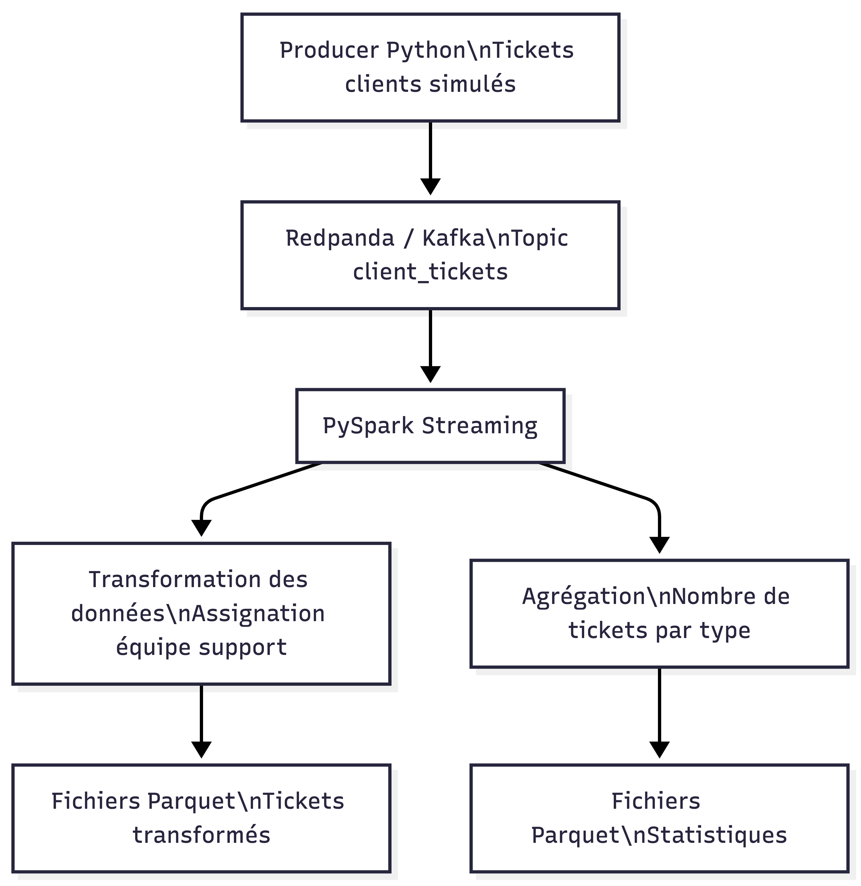

# POC Pipeline de Streaming avec Redpanda, PySpark et Docker

## Objectif du projet

Ce projet démontre la mise en place d’un **pipeline de données en streaming** permettant de simuler la gestion de tickets clients.

Les tickets sont générés par un **Producer Python**, envoyés dans **Redpanda (Kafka)** puis traités en **temps réel avec PySpark Structured Streaming**.

Les données sont ensuite stockées au format **Parquet** pour permettre leur analyse.

---

# Architecture du pipeline

Le pipeline suit les étapes suivantes :

1. Génération de tickets clients (Producer Python)
2. Envoi des tickets dans un topic Redpanda (Kafka)
3. Consommation des messages par PySpark Streaming
4. Transformation et enrichissement des données
5. Calcul des statistiques
6. Stockage des résultats en fichiers Parquet

---

# Diagramme du pipeline (Mermaid)

# Presentation du projet
https://www.loom.com/share/85907b4d39d84e6c807cfb4e2240631b